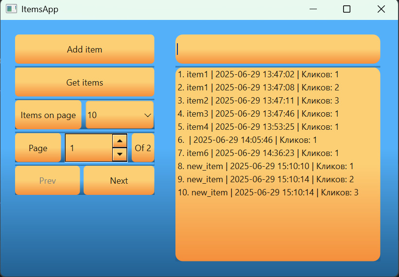

# Тестовое задание МАСТ

## Быстрый старт

### 1. Установка зависимостей
```bash
pip install -r requirements.txt
```
### 2. Создание базы данных
```bash
python server/database.py
```
(База создастся в корне проекта как app.db)
### 3. Запуск сервера
```bash
uvicorn server.server:app --reload
```
Сервер будет доступен по адресу: http://127.0.0.1:8000

Документация API: http://127.0.0.1:8000/docs

### 4. Запуск клиентского приложения
```bash
python -m client.main
```
### 5. Запуск тестов
```bash
pytest -v tests/test_server.py
pytest -v tests/test_client.py
```
### Дополнительные команды
Сборка клиента в exe (PyInstaller) - выполнять из директории client
```bash
pyinstaller client.spec
```
Сборка сервера в exe (PyInstaller) - выполнять из директории server
```bash
pyinstaller server.spec
```
### Внешний вид приложения
